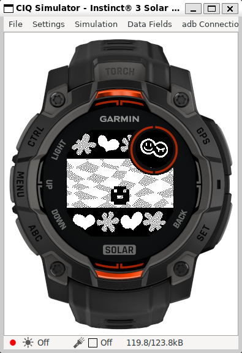
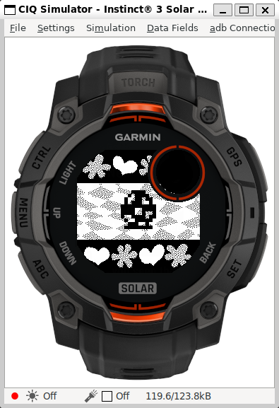
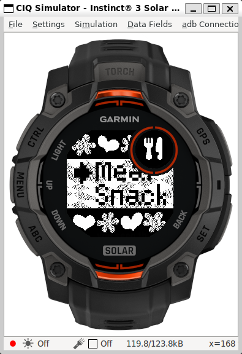
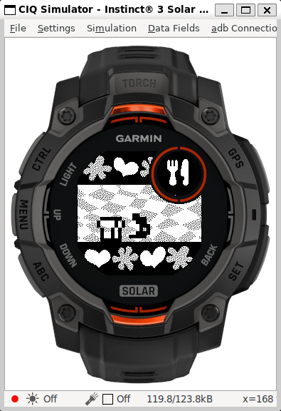
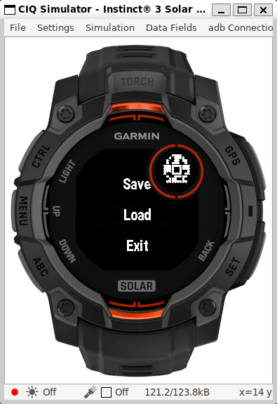

# 🐣 garmin-gotchi
## Tamagotchi Gen 1 Emulator for Garmin Instinct 3

**GarminGotchi** is a complete rewrite of the original [tamalib](https://github.com/jcrona/tamalib) project (portable Tamagotchi emulator) from C to Garmin's [Monkey C](https://developer.garmin.com/connect-iq/monkey-c/) language, developed specifically for the [Garmin Instinct 3 Solar 45mm](https://www.garmin.com/p/1315317/) smartwatch. It brings your nostalgic digital pet back to life right on your wrist.

<p align="center">
    
</p>

## 🎮 Features

- Faithful emulation of Tamagotchi Gen 1 behaviors
- Watch-native graphics with custom black and white bitmaps
- Button-controlled user interface using Garmin's physical buttons
- Sound effects support using Garmin's attention notifications
- Menu to `toggle sound`, `save`, `load`, `restart`, and `exit`
- Persistent pet data via Garmin storage APIs
- Optimized for Garmin's constrained execution model

## 📦 Project Structure

```txt
.
├── Makefile                        * Makefile script for build and simulation
├── manifest.xml                    * Connect IQ manifest
├── monkey.jungle                   * Project configuration
├── resources                       * Shared resources
│   ├── drawables                     > Launcher icon bitmap
│   ├── menus                         > Main menu configuration
│   └── strings                       > String resources
├── resources-instinct3solar45mm    * Device-specific resources
│   ├── drawables                     > Custom background and icon bitmaps
│   └── layouts                       > Layout rendering configuration
└── source                          * Monkey C source code
    ├── GarminGotchiApp.mc            > Application entry point
    ├── GarminGotchiDelegate.mc       > Application button controls
    ├── GarminGotchiMenuDelegate.mc   > Application menu for save/load/etc.
    ├── GarminGotchiView.mc           > Application graphics rendering
    ├── programs                      > Tamalib emulator programs
    │   ├── tama.mc                     - Tamagotchi rom
    │   └── test.mc                     - Test rom
    └── tamalib                       > Tamalib code rewrite in Monkey C
```

## ⚙️ Build & Flash Instructions

### 📋 Prerequisites

- [Garmin Connect IQ SDK](https://developer.garmin.com/connect-iq/sdk/)
- [Java Runtime Environment](https://www.java.com/en/download/manual.jsp)
- [Monkey C command line tools](https://developer.garmin.com/connect-iq/reference-guides/monkey-c-command-line-setup/)
- [OpenSSL](https://www.openssl.org/)
- [GNU make](https://www.gnu.org/software/make/)

Alternatively, VSCode IDE with the Monkey C extension can be used instead of the CLI; follow this [guide](https://developer.garmin.com/connect-iq/connect-iq-basics/getting-started/) for step-by-step instructions.

### 🛠️ First-Time Setup

Build and sign executable:

```sh
make all
# or, equivalently
make key # Generates the developer key
make app # Compiles the watch application
```

(Optional) Run in the simulator:

```sh
make ciq # Launches Connect IQ simulator
# wait CIQ to open
make sim # Runs the app in Connect IQ simulator
```

### ⌚ Deploying to Watch

For app deployement on the watch you must sideload the .prg file onto your Garmin device using [Garmin Express](https://www.garmin.com/it-IT/software/express/windows/) or copy it to the device storage manually in developer mode, like so:

1. Enable Developer Mode on your watch.
2. Connect it via USB.
3. Copy bin/garmingotchi.prg to the `GARMIN/APPS/` directory.
4. Restart the watch to launch the app.

### ⚠️ Limitations

- 🧠 **Memory Constraints**: The app operates under tight memory limits, adding even one more class or making too many static variables/methods could result in the app not fitting RAM anymore at some point during execution. ROM is also an issue when adding emulator programs, but this is mostly avoidable using `Lang.ByteArray` instead of `Lang.Array<Lang.Number>` which will cut down size by 4.

- 🧵 **Thread Watchdog Timer**: The Garmin Monkey C VM enforces a watchdog timer on each thread to prevent them from hanging and crashing the system; therefore, there are only so many emulator steps that we could fit in that time frame. Optimizing the code further could enable us to increase `GarminGotchiApp.RUN_MAX_STEPS` and make the game run smoother.

Despite these constraints, the game can be enjoyed at a slightly reduced cycle speed with all original functionalities.

### 📸 Screenshots

<p align="center">
    
    
    
    
    
</p>

### ⚠️ Disclamer

I am not a Garmin software developer and I mostly work with low-level languages, so a lot of stuff I had to figure out myself and hack my way around to make this port work; most likely there are better ways for running the game smoothly on the watch without issues, I am just not aware of them.

If you are a professional Garmin SW dev and want to share your knowledge or even contribute to the project, it would be very much appreciated!

### 📞 Support

For bug reports or contributions, feel free to open issues and PRs, I will review and respond to them as soon as I can.

For any questions, you can also reach me at: lorenzo.gualniera@gmail.com

### 📜 License

This project is a rewrite of [tamalib](https://github.com/jcrona/tamalib) that is distributed under `GPLv2` license; therefore, all modifications to the original source code require this project to be released under the same terms which you can find [here](./LICENSE).
