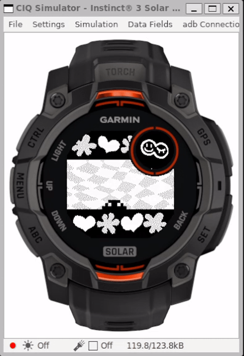

# garmin-gotchi-instinct2x

This is a fork of Gualor/garmin-gotchi with mods to get the app to run on instinct2x. Notes specific to garmin-gotchi-instinct2x follow.

## [garmin-gotchi-instinct2x] THIS IS A ROUGH PROOF OF CONCEPT FOR INSTINCT2X 🚨🚨🚨THIS FORK IS NOT PRODUCTION-READY🚨🚨🚨

This fork contains some *extremely rough* proof-of-concept changes to get the app working for
instinct2x (a Connect IQ 3 device). The original repo can be found here: https://github.com/Gualor/garmin-gotchi

Without going into too many details, let's just say that without any changes, the instinct2x version of this app would've required an additional ~200 KB available
application memory to load without modification, due to various differences between CIQ 3 (instinct2x) and CIQ 4 (instinct3solar45mm). But on the contrary, instinct2x
actually has ~32 KB less memory for `watchApp`s than instinct3solar45mm. Drastic changes had to be made.

Some of these changes will almost certainly make the app perform worse on instinct3solar45mm (and any other Connect IQ 4 devices),
not to mention the fact that they make the source much harder to maintain and understand. For example, `json.xml` is a new file which was generated from
tama.c/TAMA_PROGRAM (the tama ROM), using a combination of a one-off script (not included here) and some manual edits. In a perfect world, json.xml would be
automatically generated via a build process (so that you could use any ROM you want), but that doesn't currently happen.

Also in a perfect world, the requisite changes for instinct2x would be applied via conditional compilation (or other means) to ensure that the app would continue
to run on instinct3solar45mm without any performance changes (or other issues). However, since this is just a proof of concept, the changes for instinct2x have simply been applied unconditionally.

Additionally, some of the build switches in monkey.jungle may not work. For example:

- it is no longer possible to enable logging - logging will always be disabled
- the test ROM cannot be selected - the tama ROM will always be used

Finally, the new code is kind of a mess. It seems to work [*], but it's not exactly pretty.

- In some cases, dead code has been deliberately left in the source as comments,
instead of being removed, to provide context for new code which is optimized for instinct2x. This has not been in a consistent manner.
- Some of the new code uses hardcoded magic numbers
- [*] Speaking of which, the new code hasn't been extensively tested.

For these reasons, at this time these changes will not be submitted back to the original repository - they're simply not fit for production.

## [garmin-gotchi-instinct2x]  Instinct2x / CIQ 3 Porting Challenges

- instinct2x has ~32 KB less memory for `watchApp`s than instinct3solar45mm
- instinct2x is on Connect IQ 3 (as opposed to instinct3solar45mm, which is on CIQ 4)
- CIQ 3 lacks the shared graphics pool of CIQ 4. This means that any bitmaps that a CIQ 3 app loads are counted against app memory. Contrast with CIQ 4 apps, which load
bitmaps into the graphics pool (this does not count against app memory)
- CIQ 3 has extremely inefficient initialization for constant array/dictionary data
    - For example, in CIQ 4, 12 KB of bytearray data (such as TAMA_PROGRAM) takes roughly 12 KB in the data section of the PRG
    - In CIQ 3, the same 12 KB of bytearray data takes a whopping ~150 KB of code (roughly 1200% overhead). This is larger than the amount of memory available to instinct2x for `watchApp`s, which means that the original source does not even compile for instinct2x without error

## [garmin-gotchi-instinct2x] Overview of changes made for instinct2x

- save memory used by large amounts of data: avoid CIQ 3 array initializations and change the representation of certain data

  - `TAMA_PROGRAM` array (tama ROM)
    - convert byte array to JSON array
      - pack every 4 bytes of the source array into 1 32-bit integer in the JSON array
      - split the JSON array into 4 pieces to get around memory / watchdog limitations when the data is loaded at init time
      - move around certain init code (e.g. view/delegate initialization) to ensure there is enough headroom at init time to load the tama ROM
      - at init time, read JSON array into a byte array
      - the original data structure is ultimately preserved (it's still a ByteArray after init time), but we avoid wasting massive amounts of code in initializing the data. IOW, the
        code that uses TAMA_PROGRAM was not changed.

  - encode `SEG_POS` byte array as hex string
    - the original data structure is ultimately preserved. This is just another method of avoiding wasteful initialization code. (The code that uses SEG_POS did not change)

  - `OPS` (opcodes) array
    - remove Op class (objects are expensive)
    - convert the entire OPS array to a single flat array (nested arrays are expensive)
    - move the callback method lookup from the opcode definition to the code which handles opcodes (i.e. change `method(:some_symbol)` to `:some_symbol`)
    - in this case, the code that uses OPS had to change


- resolve issue where icon bitmaps consumed twice the memory due to being loaded twice: once in the layout and once in the Monkey C source
  - remove layout completely (it's not necessary)

- remove dead code

- remove logging code

- fold duplicated code

- manually "inline" certain functions that are only called once

- change storage keys from strings to integers

With all of these changes in place, the app just barely fits under the memory limit for instinct2x.


---

# 🐣 garmin-gotchi

## Tamagotchi Gen 1 Emulator for Garmin Instinct 3

**GarminGotchi** is a complete rewrite of the original [tamalib](https://github.com/jcrona/tamalib) project (portable Tamagotchi emulator) from C to Garmin's [Monkey C](https://developer.garmin.com/connect-iq/monkey-c/) language, developed specifically for the [Garmin Instinct 3 Solar 45mm](https://www.garmin.com/p/1315317/) smartwatch. It brings your nostalgic digital pet back to life right on your wrist.

<p align="center">
    
</p>

## 🎮 Features

- Faithful emulation of Tamagotchi Gen 1 behaviors
- Watch-native graphics with custom black and white bitmaps
- Button-controlled user interface using Garmin's physical buttons
- Sound effects support using Garmin's attention notifications
- Menu to `toggle sound`, `save`, `load`, `restart`, and `exit`
- Persistent pet data via Garmin storage APIs
- Optimized for Garmin's constrained execution model

## 📦 Project Structure

```txt
.
├── Makefile                        * Makefile script for build and simulation
├── manifest.xml                    * Connect IQ manifest
├── monkey.jungle                   * Project configuration
├── resources                       * Shared resources
│   ├── drawables                     > Launcher icon bitmap
│   ├── menus                         > Main menu configuration
│   └── strings                       > String resources
├── resources-instinct3solar45mm    * Device-specific resources
│   ├── drawables                     > Custom background and icon bitmaps
│   └── layouts                       > Layout rendering configuration
└── source                          * Monkey C source code
    ├── GarminGotchiApp.mc            > Application entry point
    ├── GarminGotchiDelegate.mc       > Application button controls
    ├── GarminGotchiMenuDelegate.mc   > Application menu for save/load/etc.
    ├── GarminGotchiView.mc           > Application graphics rendering
    ├── programs                      > Tamalib emulator programs
    │   ├── tama.mc                     - Tamagotchi rom
    │   └── test.mc                     - Test rom
    └── tamalib                       > Tamalib code rewrite in Monkey C
```

## ⚙️ Build & Flash Instructions

### 📋 Prerequisites

- [Garmin Connect IQ SDK](https://developer.garmin.com/connect-iq/sdk/)
- [Java Runtime Environment](https://www.java.com/en/download/manual.jsp)
- [Monkey C command line tools](https://developer.garmin.com/connect-iq/reference-guides/monkey-c-command-line-setup/)
- [OpenSSL](https://www.openssl.org/)
- [GNU make](https://www.gnu.org/software/make/)

Alternatively, VSCode IDE with the Monkey C extension can be used instead of the CLI; follow this [guide](https://developer.garmin.com/connect-iq/connect-iq-basics/getting-started/) for step-by-step instructions.

### 🛠️ First-Time Setup

Build and sign executable:

```sh
make all
# or, equivalently
make key # Generates the developer key
make app # Compiles the watch application
```

(Optional) Run in the simulator:

```sh
make ciq # Launches Connect IQ simulator
# wait CIQ to open
make sim # Runs the app in Connect IQ simulator
```

### ⌚ Deploying to Watch

For app deployement on the watch you must sideload the .prg file onto your Garmin device using [Garmin Express](https://www.garmin.com/it-IT/software/express/windows/) or copy it to the device storage manually in developer mode, like so:

1. Enable Developer Mode on your watch.
2. Connect it via USB.
3. Copy bin/garmingotchi.prg to the `GARMIN/APPS/` directory.
4. Restart the watch to launch the app.

### ⚠️ Limitations

- 🧠 **Memory Constraints**: The app operates under tight memory limits, adding even one more class or making too many static variables/methods could result in the app not fitting RAM anymore at some point during execution. ROM is also an issue when adding emulator programs, but this is mostly avoidable using `Lang.ByteArray` instead of `Lang.Array<Lang.Number>` which will cut down size by 4.

- 🧵 **Thread Watchdog Timer**: The Garmin Monkey C VM enforces a watchdog timer on each thread to prevent them from hanging and crashing the system; therefore, there are only so many emulator steps that we could fit in that time frame. Optimizing the code further could enable us to increase `GarminGotchiApp.RUN_MAX_STEPS` and make the game run smoother.

Despite these constraints, the game can be enjoyed at a slightly reduced cycle speed with all original functionalities.

### 📸 Screenshots

<p align="center">
    
    
    
    
    
</p>

### ⚠️ Disclamer

I am not a Garmin software developer and I mostly work with low-level languages, so a lot of stuff I had to figure out myself and hack my way around to make this port work; most likely there are better ways for running the game smoothly on the watch without issues, I am just not aware of them.

If you are a professional Garmin SW dev and want to share your knowledge or even contribute to the project, it would be very much appreciated!

### 📞 Support

For bug reports or contributions, feel free to open issues and PRs, I will review and respond to them as soon as I can.

For any questions, you can also reach me at: lorenzo.gualniera@gmail.com

### 📜 License

This project is a rewrite of [tamalib](https://github.com/jcrona/tamalib) that is distributed under `GPLv2` license; therefore, all modifications to the original source code require this project to be released under the same terms which you can find [here](./LICENSE).
